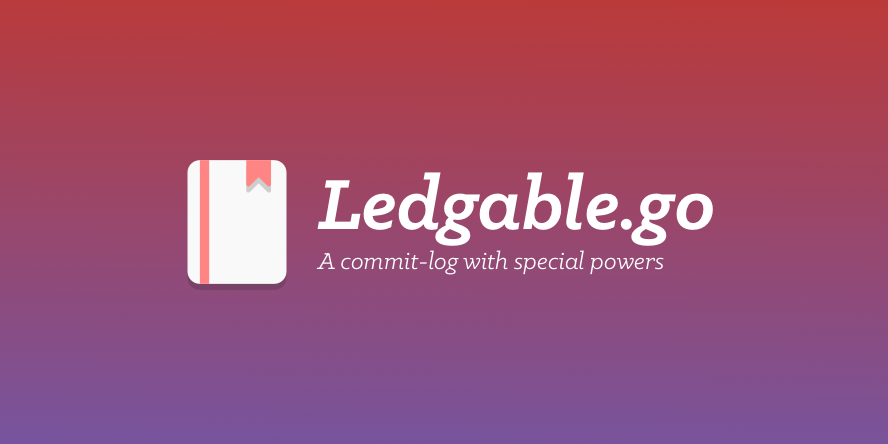

 

[](https://github.com/sotownsend/ledgable.go/blob/master/LICENSE)
[](https://circleci.com/gh/sotownsend/ledgable.go)

# What is this?

A package that provides generics for creating your own ledger. 
A *ledger* is a generic data-structure that holds an ordered & prioritized list of `Commit` objects. How information is stored in a
ledger is user defined.

# Usage


```go

// Filled out yay
type LedgerEntry struct {
}

masterLedger := NewLedger(LedgerOps{
  ExecQuery: func (query *LedgerQuery) []LedgerEntry {
  },
})

masterLedger.RegisterObjectLookup("premium_purchase", func (objectId int) interface{} {
  return NewPremiumPurchase(objectId)
}

// Register an apply function for user
masterLedger.AddApply("apply_premiums_to_user", func (obj interface{}, entry *LedgerEntry) {
  // We're applying changes to user
  u := obj.(User)
  
  if entry.Type == "premium_purchase" {
    pp := entry.GetObject().(PremiumPurchase)
    
    features := pp.GetPremiumFeatureSet().GetFeatures()
    
    u.PremiumFeatures = append(u.Premiumfeatures, features)
  }
}

func (l *Ledger) Apply(name string, []ledgerQueries queries, obj interface{}) {
  res := []LedgerEntries{}
  for q := range queries {
    e := q.Exec()
    res = append(res, e)
  }
  
  
  applyF := ledger.LookupApplyFunction(name)
}

type struct LedgerQuery {
  userInfo interface{}
  
  type string
  showExpired bool
  
  startDateRange time.Time
  endDateRange time.Time
}

func (l *Ledger) Query() (*LedgerQuery) {
  return &LedgerQuery{
    showExpired: true
  }
}

func (l *LedgerQuery) HideExpired() *LedgerQuery {
  l.showExpired = false
  
  return l
}

func (l *Ledger) WithType(type string) (*LedgerQuery) {
  return LedgerQuery{
    type: type
  }
}

func (l *Ledger) LookupObject(type string, id int) {
  f, ok := l.RegisteredObjects[type]
  if !ok { panic("Ledger: The object type '%s' was not registered, please register this type with RegisterObjectLookup") }
  
  return f(id)
}

func (le *LedgerEntry) GetObject() interface{} {
  le.Ledger.registeredObjectTypes[le.Type]
}
```

### Example Use Cases

##### Allowing In-app purchases and AB tests to co-exist.
Let's say you have an app has both IAP non-consumables and AB tests.  Imagine you also have a consumable named `foo` which affects property `zir`.  Then you also have an AB test named `bar` which affects property `zir` and `zim`.

##### Managing IAP subscriptions
You have an app that relies on subscriptions for a subset to enable a subset of features.  You need to make sure a subscription is valid and have a way of checking whether the subscription has expired.

## Example

### Step 1
Let's start by creating a new ledger.  We'll be storing all of our commits in this log location.

```go
import (
  "github.com/sotownsend/ledger"

  var commitLog Ledger
  func main() {
    // Set-up our ledger
    commitLog = ledger.NewLedger("commits", CommitOps{
    })

    // Configure this ledgers operations
)
```

### Step 2
For each `struct` **definition** (**i.e. not instance level, class level**), you will need to create an `LZArena` and add a set of zones.

```go
// Create an LZArena to store our zone operations
var UserArena = NewLZArena()

// Add our zones to the arena
var UserSQLZone = UserArena.AddZone(LZops{
  Fetch: func (obj {}interface) {
    u := obj.(*User)
    SqlQueryToGetNameAndAge(u)
  },
  Flush: func (obj {}interface, tags []string) error {
	u := obj.(*User)

  StartSQLTransaction()
  
  for _, tag := range tags {
   switch tag {
     case 'name':
       UpdateNameViaSQL(u)
     case 'age':
       UpdateAgeViaSQL(u)
   }
  }

  // If commit fails, it will return an error
  err := CommitSQLTransaction()
  return err
})

var UserRedisZone = UserArena.AddZone(LZops{
  Fetch: func (obj {}interface) {
    u := obj.(*User)
    RedisQueryToGetPeopleViewingMe()
  },
  Flush: func (obj {}interface, tags []string) {
	u := obj.(*User)
	Panic("unsupported")
  },
})

func NewUser() *User {
  u := &User{}
  
  //Ensure lz is initiatilized
  u.lz.Init(UserArena, u)
}
```

### Step 3

##### Getters
For your applicable getters on your model, you need to add a `Fetch` before attempting to read from the model.  This `Fetch` call won't do anything if the data was previously fetched but not dirty.

```go
func (u *User) GetName() string {
  // Will only call once if zone is not fetched. Sets state to clean.
  u.lz.Fetch(UserSQLZone)
}
```

##### Setters
For your applicable setters on your model, you need to note that a zone has been dirtied. You can add 'tags' which
will be available in your flush routine so you can update only the fields that have changed.

```go
func (u *User) SetName(name string) string {
  u.lz.SetDirty(UserSQLZone, "name")
  
  u.Name = name
}
```

### Step 4 
Now your ready to call `err := u.lz.Flush()` when you're ready to save all dirty changes. If any of the zones fails to flush (zone flush ops returns error), then this will return the first error and not complete the flush.

## Communication
> ♥ This project is intended to be a safe, welcoming space for collaboration, and contributors are expected to adhere to the [Contributor Covenant](http://contributor-covenant.org) code of conduct.

- If you **found a bug**, open an issue.
- If you **have a feature request**, open an issue.
- If you **want to contribute**, submit a pull request.

---

## FAQ

Todo

### Creator

- [Seo Townsend](http://github.com/sotownsend) ([@seotownsend](https://twitter.com/seotownsend))


## License

ledger is released under the MIT license. See LICENSE for details.
